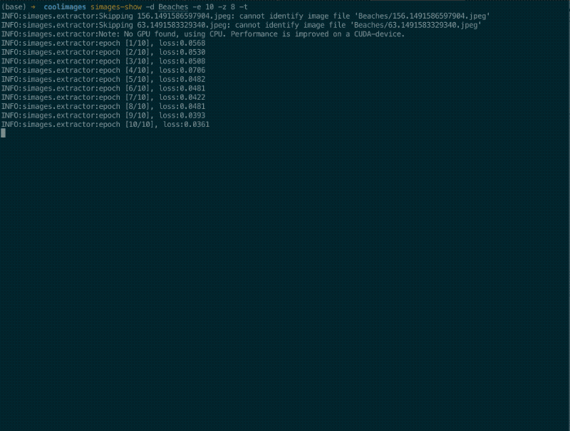

# simages :monkey_face: :monkey_face:
[](https://badge.fury.io/py/simages) [](https://travis-ci.com/justinshenk/simages)  [](https://simages.readthedocs.io/en/latest/?badge=latest)
       [](https://mybinder.org/v2/gh/justinshenk/simages/master?filepath=demo.ipynb)

*simages* is an image duplicate (or similar image) finder. Useful for finding duplicates images within a dataset
.

The Python API returns `pairs, duplicates`, where pairs are the (ordered) closest pairs and distances is the 
corresponding embedding distance.

### Install

See the [installation docs](https://simages.readthedocs.io/en/latest/install.html) for all details. *simages* depends on
the following packages:

- [closely](https://github.com/justinshenk/closely)
- [torch](https://pytorch.org)
- [torchvision](https://pytorch.org)
- scikit-learn
- matplotlib

```bash
pip install simages
```

or install from source:
```bash
git clone https://github.com/justinshenk/simages
cd simages
pip install .
```

### Demo

```simages-show```:



```simages add/find```:


### Usage

Two interfaces exist:

- matplotlib interface which plots the duplicates for visual inspection
- mongodb + web server interace which allows interactive deletion
 
#### Matplotlib interface

In your console, enter the directory with images and use `simages-show`:

```bash
$ simages-show --data-dir .
```

```
usage: simages-show [-h] [--data-dir DATA_DIR] [--show-train]
                    [--epochs EPOCHS] [--num-channels NUM_CHANNELS]
                    [--pairs PAIRS] [--zdim ZDIM] [-s]

  -h, --help            show this help message and exit
  --data-dir DATA_DIR, -d DATA_DIR
                        Folder containing image data
  --show-train, -t      Show training of embedding extractor every epoch
  --epochs EPOCHS, -e EPOCHS
                        Number of passes of dataset through model for
                        training. More is better but takes more time.
  --num-channels NUM_CHANNELS, -c NUM_CHANNELS
                        Number of channels for data (1 for grayscale, 3 for
                        color)
  --pairs PAIRS, -p PAIRS
                        Number of pairs of images to show
  --zdim ZDIM, -z ZDIM  Compression bits (bigger generally performs better but
                        takes more time)
  -s, --show            Show closest pairs

```

#### Web Interface

Add your pictures to the database
(this will take some time depending on the number of pictures)

```bash
simages add <images_folder_path>
```

A webpage will come up with all of the similar or duplicate pictures
```
simages find <images_folder_path>
```

```bash
Usage:
    simages add <path> ... [--db=<db_path>] [--parallel=<num_processes>]
    simages remove <path> ... [--db=<db_path>]
    simages clear [--db=<db_path>]
    simages show [--db=<db_path>]
    simages find <path> [--print] [--delete] [--match-time] [--trash=<trash_path>] [--db=<db_path>] [--epochs=<epochs>]
    simages -h | --help
Options:
    -h, --help                Show this screen
    --db=<db_path>            The location of the database or a MongoDB URI. (default: ./db)
    --parallel=<num_processes> The number of parallel processes to run to hash the image
                               files (default: number of CPUs).
    find:
        --print               Only print duplicate files rather than displaying HTML file
        --delete              Move all found duplicate pictures to the trash. This option takes priority over --print.
        --match-time          Adds the extra constraint that duplicate images must have the
                              same capture times in order to be considered.
        --trash=<trash_path>  Where files will be put when they are deleted (default: ./Trash)
        --epochs=<epochs>     Epochs for training [default: 2]
```


### Python APIs

#### Numpy array

```python
from simages import find_duplicates
import numpy as np

array_data = np.random.random(100, 3, 48, 48)# N x C x H x W
pairs, distances = find_duplicates(array_data)
 
```

#### Folder

```python
from simages import find_duplicates

data_dir = "my_images_folder"
pairs, distances = find_duplicates(data_dir)
 
```

Default options for `find_duplicates` are:

```
def find_duplicates(
    input: Union[str or np.ndarray],
    n: int = 5,
    num_epochs: int = 2,
    num_channels: int = 3,
    show: bool = False,
    show_train: bool = False,
    **kwargs
):
    """Find duplicates in dataset. Either `array` or `data_dir` must be specified.

    Args:
        input (str or np.ndarray): folder directory or N x C x H x W array
        n (int): number of closest pairs to identify
        num_epochs (int): how long to train the autoencoder (more is generally better)
        show (bool): display the closest pairs
        show_train (bool): show output every
        z_dim (int): size of compression (more is generally better, but slower)
        kwargs (dict): etc, passed to `EmbeddingExtractor`

    Returns:
        pairs (np.ndarray): indices for closest pairs of images, n x 2 array
        distances (np.ndarray): distances of each pair to each other
```

#### `Embeddings` API

```python
from simages import Embeddings
import numpy as np

# X is an n x m numpy array
N = 1000
data = np.random.random((N, 28, 28))
embeddings = Embeddings(data)

# Access the array
array = embeddings.array # N x z (compression size)

# Get 10 closest pairs of images
pairs, distances = embeddings.duplicates(n=5)

```

```python
In [0]: pairs
Out[0]: array([[912, 990], [716, 790], [907, 943], [483, 492], [806, 883]])

In [1]: distances
Out[1]: array([0.00148035, 0.00150703, 0.00158789, 0.00168699, 0.00168721])
```

#### `EmbeddingExtractor` API

```python
from simages import EmbeddingExtractor
import numpy as np

# X is an n x m numpy array
N = 1000
data = np.random.random((N, 28, 28))
extractor = EmbeddingExtractor(data, num_channels=1)

# Show 10 closest pairs of images
pairs, distances = extractor.show_duplicates(n=10)

```

Class attributes and parameters:

```python
class EmbeddingExtractor:
    """Extract embeddings from data with models and allow visualization.

    Attributes:
        trainloader (torch loader)
        evalloader (torch loader
        model (torch.nn.Module)
        embeddings (np.ndarray)

    """
    def __init__(
        self,
        input:Union[str, np.ndarray],
        num_channels=None,
        num_epochs=2,
        batch_size=32,
        show_train=True,
        show=False,
        z_dim=8,
        **kwargs,
    ):
    """Inits EmbeddingExtractor with input, either `str` or `np.nd.array`, performs training and validation.
    
    Args:
    input (np.ndarray or str): data
    num_channels (int): grayscale = 1, color = 3
    num_epochs (int): more is better (generally)
    batch_size (int): number of images per batch
    show_train (bool): show intermediate training results
    show (bool): show closest pairs
    z_dim (int): compression size
    kwargs (dict)
    
    """

```

You can specify how many pairs you want to identify with `n`.
 
### How it works

Simages uses a convolutional autoencoder with PyTorch and compares the latent representations with [closely](https://github.com/justinshenk/closely).
